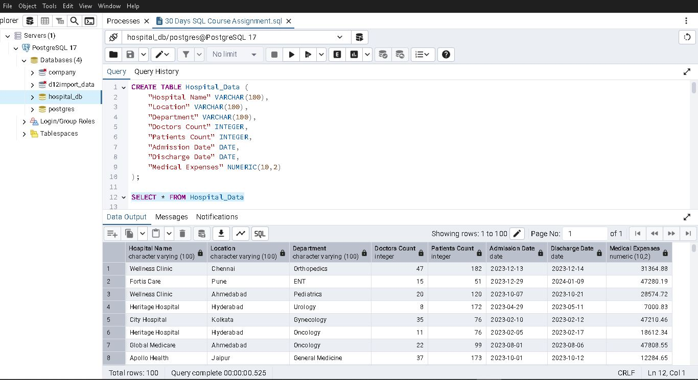

---

## 🎯 Project Objective

- **Design** a normalized schema for hospital operations (patients, doctors, admissions, billing)
- **Populate** the database with realistic sample data
- **Query** the data to answer business questions and produce summary reports
- **Practice** advanced SQL features: joins, subqueries, CTEs, window functions, and aggregate logic

---

## 🔍 Sample Queries Demonstrated

- Total patients admitted per department
- Doctors ranked by patient count
- Average length of stay by ward
- Billing summary by patient and treatment
- Daily admissions trends
- Running totals & moving averages via window functions

---

## 📸 Screenshot Preview

---

## 🔧 Tools & Environment

- **SQL Dialect:** Compatible with MySQL & PostgreSQL  
- **IDE:** pgAdmin 4 / MySQL Workbench  
- **Version Control:** Git & GitHub  

---

## 🧠 Skills Highlighted

- Data modeling & schema creation  
- CRUD operations & complex querying  
- Data aggregation & reporting  
- Use of CTEs, views, and window functions  
- Real‑world scenario simulation for healthcare analytics  

---

## 📈 Next Steps

1. **Add** sample stored procedures or triggers  
2. **Connect** to Power BI for dashboard visualizations  
3. **Document** ER diagram for schema clarity  
4. **Expand** dataset with outpatient and inventory tables  

